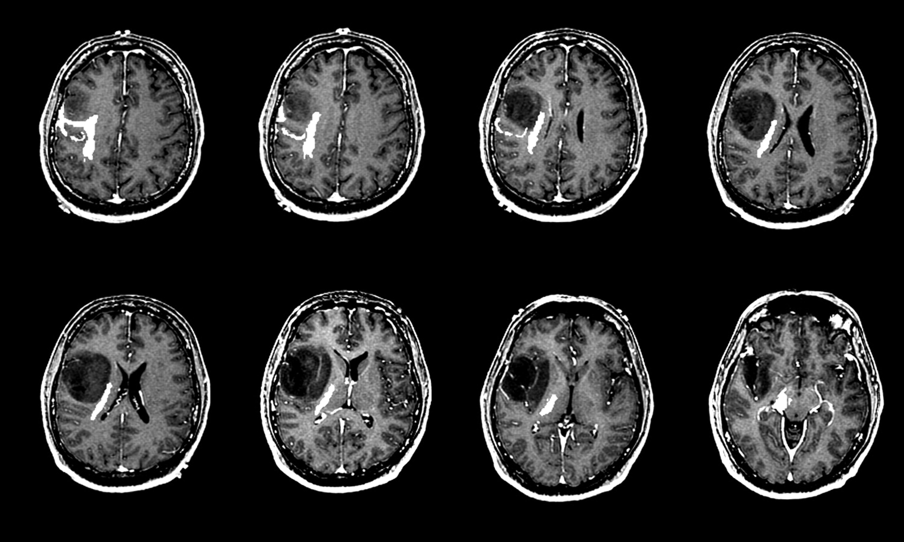

# Vision Transformers in Medical Imaging: Brain Tumor Classification

In this project, we will investigate the effectiveness of Vision Transformers (ViT) in tackling challenging problem of medical imaging using the Brain Tumor dataset. While Convolutional Neural Networks (CNNs) have long been the standard for computer vision tasks, ViT offers a novel approach by leveraging self-attention mechanisms derived from the Transformer architecture, which was initially developed for natural language processing.

<div align="center">
  
</div>

# Vision Transformer (ViT)

A Vision Transformer (ViT) is an advanced deep learning model that adapts the Transformer architecture—originally developed for processing sequential data such as text—to analyze images. Instead of relying on traditional convolutional operations, ViT segments an image into uniform patches and converts them into numerical representations. These representations are then processed as sequential data through Transformer layers, allowing the model to effectively learn intricate patterns and relationships at both local and global levels within the image.

<div align="center">
  
</div>

In this project, we have developed a specialized Vision Transformer (ViT) model for classifying brain tumors. The architecture begins with a patch embedding layer that segments the input images into fixed-size patches, followed by a series of Transformer encoder layers. By leveraging self-attention mechanisms, the model effectively captures complex spatial interactions across different regions of brain scans, enhancing its ability to distinguish between tumor types with high accuracy.


# Data Exploration and Visualization

Our dataset consists of 7022 images, which are split as follows:

```python
Found 5712 files belonging to 4 classes.
Using 4570 files for training.
Found 5712 files belonging to 4 classes.
Using 1142 files for validation.
Found 1311 files belonging to 4 classes.
```


