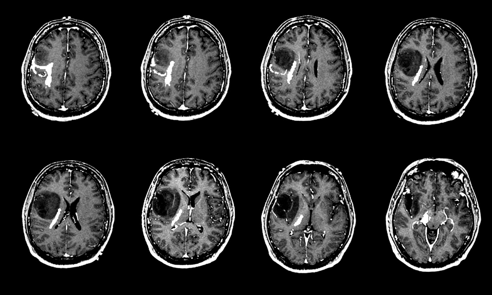
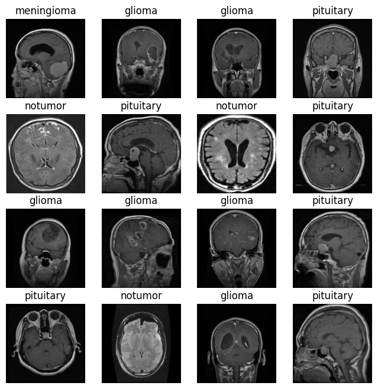
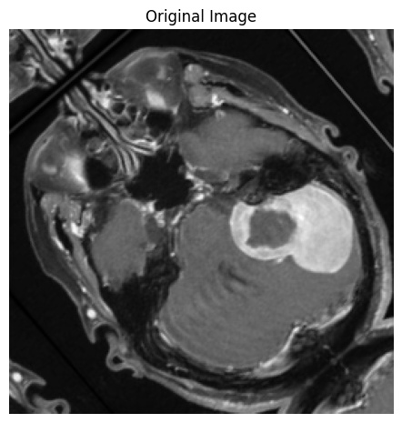
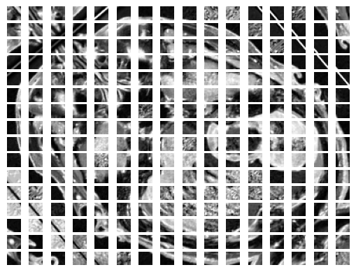
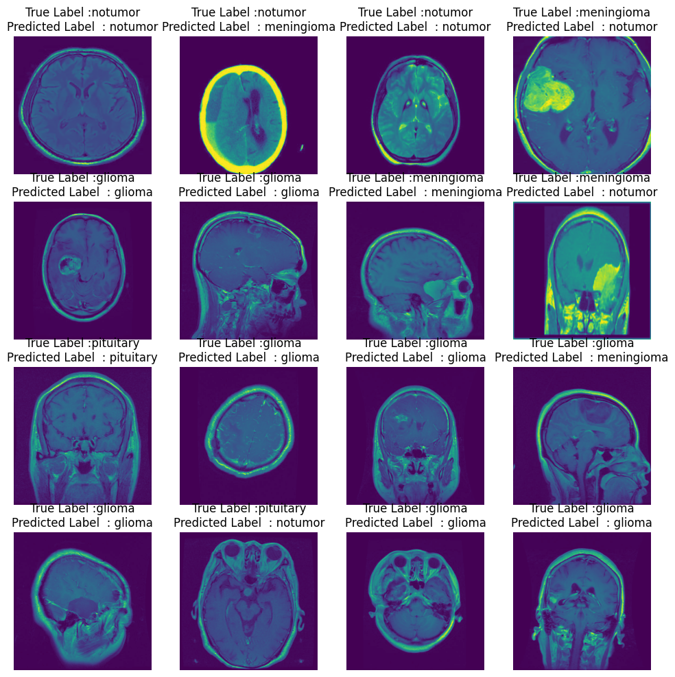
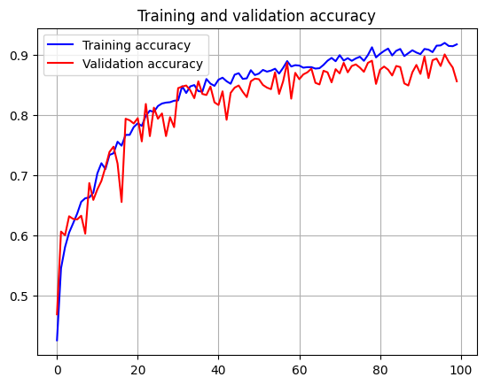
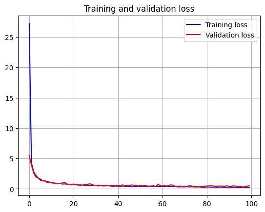
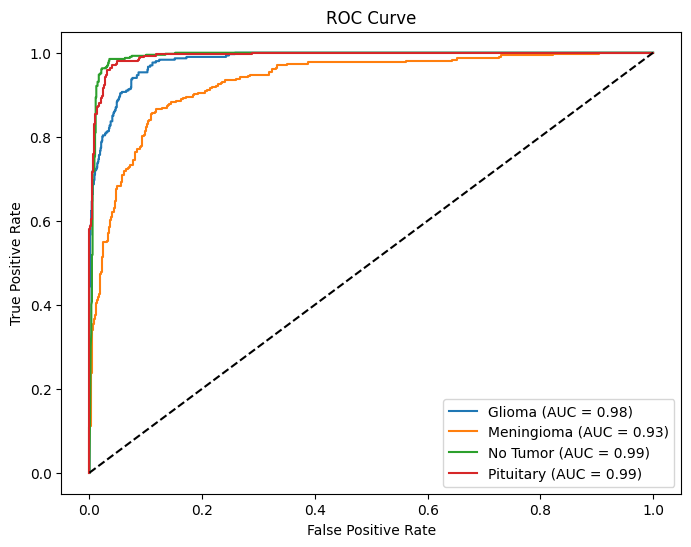
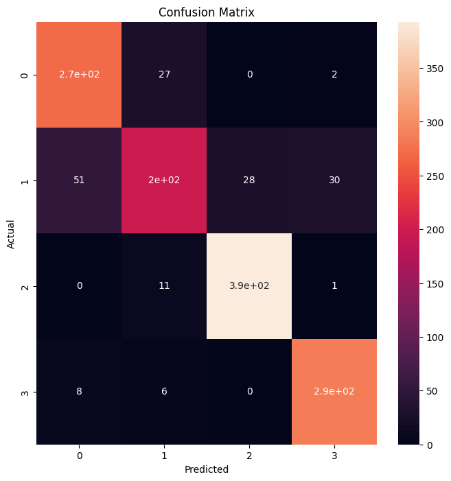

# A Vision Transformer for Brain Tumor Detection & Classification

In this project, we will investigate the effectiveness of Vision Transformers (ViT) in tackling challenging problem of medical imaging using the Brain Tumor dataset. While Convolutional Neural Networks (CNNs) have long been the standard for computer vision tasks, ViT offers a novel approach by leveraging self-attention mechanisms derived from the Transformer architecture, which was initially developed for natural language processing.

<div align="center">
  
</div>

# Introduction to Vision Transformers (ViT's)

A Vision Transformer (ViT) is an advanced deep learning model that adapts the Transformer architecture—originally developed for processing sequential data such as text—to analyze images. Instead of relying on traditional convolutional operations, ViT segments an image into uniform patches and converts them into numerical representations. These representations are then processed as sequential data through Transformer layers, allowing the model to effectively learn intricate patterns and relationships at both local and global levels within the image.

<div align="center">
  
</div>

In this project, we have developed a specialized Vision Transformer (ViT) model for classifying brain tumors. The architecture begins with a patch embedding layer that segments the input images into fixed-size patches, followed by a series of Transformer encoder layers. By leveraging self-attention mechanisms, the model effectively captures complex spatial interactions across different regions of brain scans, enhancing its ability to distinguish between tumor types with high accuracy.


# Data Exploration and Visualization

The Brain Tumor dataset is a collection of brain MRI images from patients both with and without brain tumors. Each image poses a distinct challenge because of differences in size, resolution, and contrast. Our objective is to utilize the ViT architecture to create a strong classification model capable of accurately detecting brain tumors in these MRI scans. 
Our dataset consists of 7022 images, which are split as follows:

```python
Found 5712 files belonging to 4 classes.
Using 4570 files for training.
Found 5712 files belonging to 4 classes.
Using 1142 files for validation.
Found 1311 files belonging to 4 classes.
```
```
Sample Image Shape: (512, 512, 3)
```
## Sample labeled images:

<div align="center">
  
</div>


# ViT Model Architecture

| Layer (Type)               | Output Shape  | Param #     |
|----------------------------|--------------|-------------|
| patch_encoder (PatchEncoder) | ?            | 32,832      |
| transformer_encoder (TransformerEncoder) | ? | 70,784      |
| transformer_encoder (TransformerEncoder) | ? | 70,784      |
| transformer_encoder (TransformerEncoder) | ? | 70,784      |
| transformer_encoder (TransformerEncoder) | ? | 70,784      |
| transformer_encoder (TransformerEncoder) | ? | 70,784      |
| transformer_encoder (TransformerEncoder) | ? | 70,784      |
| transformer_encoder (TransformerEncoder) | ? | 70,784      |
| transformer_encoder (TransformerEncoder) | ? | 70,784      |
| transformer_encoder (TransformerEncoder) | ? | 70,784      |
| transformer_encoder (TransformerEncoder) | ? | 70,784      |
| transformer_encoder (TransformerEncoder) | ? | 70,784      |
| transformer_encoder (TransformerEncoder) | ? | 70,784      |
| transformer_encoder (TransformerEncoder) | ? | 70,784      |
| transformer_encoder (TransformerEncoder) | ? | 70,784      |
| transformer_encoder (TransformerEncoder) | ? | 70,784      |
| transformer_encoder (TransformerEncoder) | ? | 70,784      |
| flatten (Flatten)         | (None, 16384) | 0           |
| dense_31 (Dense)          | (None, 1024)  | 16,778,240  |
| dense_32 (Dense)          | (None, 1024)  | 1,049,600   |
| dense_33 (Dense)          | (None, 4)     | 4,100       |

```
Total params: 56,779,598 (216.60 MB)
Trainable params: 18,926,532 (72.20 MB)
Non-trainable params: 0 (0.00 B)
Optimizer params: 37,853,066 (144.40 MB)
```

## Patching: Image as a Sequence

Transformer models were developed with sequence data in mind, such as English sentences. However, an image is not a sequence. To apply Transformer architecture, we need to transform input image to a sequence. This process is called **patchification**.

After the input image is patchified, we add so called positional embedings. Positional embedding allows the model to understand where each patch would be placed in the original image. We learn those embeddigns from the data, in a form of a simple, learnable matrix.

<table style="width: 90%; table-layout: fixed;">
  <tr>
    <td align="center">
      
    </td>
    <td align="center">
      
    </td>
  </tr>
  <tr>
    <td align="center" style="background-color: #333; color: white; padding: 10px; border-radius: 5px;">
      <strong>Before Patching</strong>
    </td>
    <td align="center" style="background-color: #333; color: white; padding: 10px; border-radius: 5px;">
      <strong>After Patching</strong> 
    </td>
  </tr>
</table>


## Test Predictions

We use the Adam optimizer with a learning rate of 0.0001 and weight decay of 0.0001. The model is trained with a batch size of 32 for 100 epochs. During training, a periodic evaluation on a test set is performed to track performance metrics including loss, accuracy, and confusion matrix. These metrics are closely monitored to assess the model’s performance and ensure accurate classification across the four classes: glioma, meningioma, notumor, and pituitary.

<div align="center">
  
</div>

## Accuracy and Loss Curves
<div align="center">
  
  
</div>

## ROC Curve

<div align="center">
  
</div>


## Confusion Matrix

<div align="center">
  
</div>


